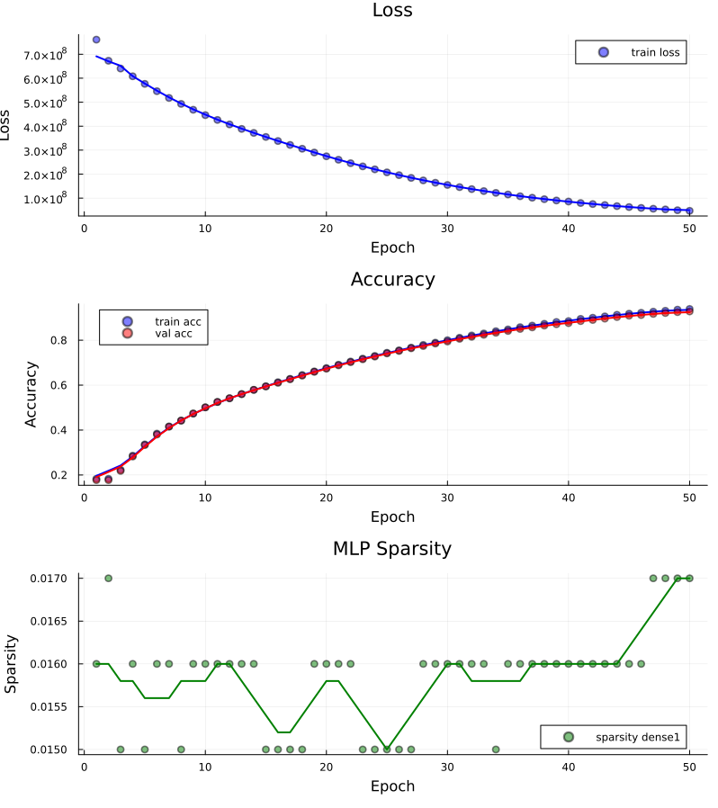

# BayesGPT-I 🎲

> What if a GPT was honest about what it doesn't know?

BayesGPT-I is a minimal Bayesian GPT decoder implemented from scratch in Julia.
It is a transformer that doesn't simply learn -- it **learns what to forget**, and
**tells you when it is uncertain**. 

Built as a direct exntesion to my MSc Dissertation at St Andrews : `Practical Variational Inference of Bayesian Neural Networks`, BayesGPT-I is the decoder version of the Variational Dropout-enhanced Transformer Network in my dissertation. With only 2M parameters, and two modified transformer layers, it is closer to an autocomplete engine that returns uncertainity with its predictions.


The pretrained model was trained on 11 free works from project Guthenberg(included in the data folder)
The works include:

- *The Count of Monte Cristo* —- Alexander Dumas
- *At The Mountains of Madness* -- H.P. Lovecraft
- *The Wonderful Wizard of Oz* -- Frank Baum

## Why Julia?

Because if you're going to be uncertain about your weights,
you might as well be certain about your types.

Julia's parametric type system means custom layers like
`VariationalDropoutMolchanov` run at near-C speed without
writing a single line of C++. In PyTorch, a custom layer
written in pure Python would be orders of magnitude slower.

**Main trade-offs**

1. Word-level (naive) tokenization : this ensures training is made to predict the next "word", still rendering human-like sentences. NOT using BytePair, as this would substantially increase the number of "classes" to predict over. For CPU training and demonstration we want reasonable training times.

2. Short texts are excluded for training data. I focus on context-rich paragraphs that are at least 200 characters long. This means many shorter senteces from the sources are excluded, the model learning from a variety of styles and focusing on quality paragraphs.

3. 128 embedding length is a practical choice to speed up training. It can be set freely with more compute power.

4. The model is a two-layer TransformerBlock. Each Transformer block has one Multihead Attention layers & one two-layered Variational MLP(the latter is the Bayesian/Variational part). This is the simplest model possibly, chosen because (i) the corpus of data is small and (ii) speeding up training.

5. Words that appear less than 10 times in the corpus are discarded. This allows for smaller but better vocabulary. 

**Model properties**

- vocab size : 5000
- total parameters : 2M

By comparison, [GPT-3](https://en.wikipedia.org/wiki/GPT-3) has 175 billion parameters. Hence `BayesGPT-I` is 0.001% of GPT3 size. A true experiment would train it at scale, which is impossible with one machine. No reinforcement learning means GPTBayes-I is just a Bayesian autocomplete engine, not full chatbot. 


---

## Core concept

A standard GPT learns **point estimates** for its weights:

```
W = 0.73   ← this weight is exactly 0.73, always
```

BayesGPT-I learns **an approximate distributions** over its MLP weights:

```
W ~ N(0.73, σ²)   ← this weight is probably around 0.73, but uncertain
```

This single change gives you three things for free:

**1. Automatic weight pruning**

The ELBO loss simultaneously fits the data and removes unnecessary weights:

```
L = N * NLL  +  β · 1/N * KL
```

Weights the model is uncertain about get pruned automatically.
No separate pruning step, as each distribution over each weight has a natural 
SNR ratio, which can actually be expressed as a logarithm :

```
logα = logσ² - 2·log|θ|
```

If the standard deviation is too large with respect to the mean, distribution is safe to prune, as sampling from it
will actually be just noise. We use a heuristic `logα = 3` as this already means the standard deviation is ~20 times greater than the mean. 

**2. Uncertainty at generation time**

Each forward pass samples different weights `W ~ N(θ, σ²)`.
Run the same prompt 20 times → 20 slightly different outputs.
The variance across those outputs is genuine model uncertainty:

```
"he knows human land million"

  human   σ=0.281  moderate    ← somewhat confident
  million σ=0.303  uncertain   ← many alternatives here
```

---

## Training Results

Trained on ~8663 lines from only 11 sources.
2 million parameters, 50 epochs, CPU only (Apple M2, ~2 hours).

The train-validation split is 90% - 10%. 

I used a "warmup" phase where the KL divergence is linearly introduced over 20 epochs : from 0 to 1/N * KL (scaled by the data length)




**Observations**

- No significant overfit, as the gap between training and validation remains very small
- Not fully converged, so it could be trained for further 20-30 epochs. 

**Three generation modes, same seed:**

```
Seed: "he knows"

Standard (k=vocab):    "he knows edmond cheap seldom"     <- not much coherence
Top-k=50 + penalty:    "he knows high once himself" ← literary!
Bayesian (20 passes):  "he knows human land million"
                        human  σ=0.281  moderate
                        land σ=0.285  moderate
                        million   σ=0.303  uncertain
```

**Sparsity:**

Sparsity stayed low (~1%) because the model is not overparameterised
relative to 11 books. With a larger model or more data, the KL term
would prune more aggressively -- this remains to be tested!.
The uncertainty signal however works correctly at any scale.  The model knows what it doesn't know.

---

## Architecture

```
Input tokens  (1, T, B)

Embed                            <- learned token embeddings
      ↓
PositionEncoding                 <- fixed sinusoidal (Vaswani et al. 2017)
      ↓
Dropout
      ↓
TransformerDecoderBlock × 2
  ├── CausalMultiheadAttention   ← standard point estimate weights
  ├── LayerNorm + residual
  ├── VariationalDropout         ← BAYESIAN (dm → dhid)
  ├── VariationalDropout         ← BAYESIAN (dhid → dm)
  └── LayerNorm + residual
      ↓
Dense(embed_dim, vocab_size)     ← logits at every position
      ↓
Output  (vocab_size, T, B)
```

Only the MLP layers inside each decoder block are Bayesian. Hence, the  variational dropout layers
are actually inside MLP, as we still use regular dropout outside. 
Hence, attention weights are standard point estimates. This is a deliberate choice:


- attention learns *routing*, which can be dangerous to prune
-  MLP learns *knowledge* (safe to prune).

This is a surgically-modified GPT, with emphasis on its MLP component. 

---

## The ELBO Loss

Training minimises the negative Evidence Lower Bound:

```
L = N · NLL(ŷ, y)  +  β · (1/N) · Σ KL(q(W|θ,σ) ‖ p(W))
```

Where KL uses the closed-form approximation from Molchanov et al. (2017):

```
KL ≈ Σᵢⱼ [ -k₁ + k₁·σ(k₂ + k₃·logα) - 0.5·log(1 + exp(-logα)) ]

logα = logσ² - 2·log|θ|   ← signal-to-noise ratio per weight
```

When `logα ≥ 3`, the weight is effectively noise and is pruned.

**KL warm-up** grows β from 0 -> 1 over 30 epochs, preventing
aggressive pruning before the model has learned anything useful.

---

## Quickstart

```bash
# 1. Clone
git clone https://github.com/yourname/BayesGPT-I
cd BayesGPT-I

# 2. Install dependencies
julia --project=. -e 'using Pkg; Pkg.instantiate()'

# 3. Add your text data
cp your_book.txt data/

# 4. Train
julia --project=. run.jl

# 5. Generate
julia --project=. generate_only.jl
```

---

## Start the notebook for data exploration

From the root folder (where `Project.toml` is) run :

```bash
julia --project=. --threads auto -e 'using Pluto; Pluto.run()'
```

Then create new notebook or select an existing one. This allows clear EDA for content, which can inform different tokenization strategies. 

## Try the Pretrained Model

Training on CPU can take a very long time? Download the pretrained weights and generate immediately:

```bash
# 1. Clone
git clone https://github.com/yourname/BayesGPT-I
cd BayesGPT-I

# 2. Install dependencies
julia --project=. -e 'using Pkg; Pkg.instantiate()'

# 3. Download pretrained weights (trained on Gutenberg novels)
# model.bson and tokenizer.bson are included in the repo

# 4. Generate immediately
julia --project=. generate_only.jl
```

Try these seeds out of the box:

```julia
# in generate_only.jl, change the seed to any of these:

bayesian_generate_report(model, tokenizer, "he knows";
                         n_forward=20, max_length=5,
                         temperature=0.8f0, k=50, penalty=1.5f0)

bayesian_generate_report(model, tokenizer, "she wanted";
                         n_forward=20, max_length=5,
                         temperature=0.8f0, k=50, penalty=1.5f0)

bayesian_generate_report(model, tokenizer, "the war was";
                         n_forward=20, max_length=5,
                         temperature=0.8f0, k=50, penalty=1.5f0)
```


## Interactive Demo

The project comes with a julia app, where you can add your input directly into the window and select params.

Run locally with:
```bash
julia --project=. app.jl
```
Then open `http://localhost:8080`

## Project Structure

```
BayesGPT-I/
├── run.jl                      # training entry point
├── generate_only.jl            # generation + uncertainty demo
├── Project.toml
├── src/
│   ├── layers.jl               # Embed, PositionEncoding, VariationalDropout
│   ├── attention.jl            # bidirectional MultiheadAttention
│   ├── attention_causal.jl     # causal mask + CausalMultiheadAttention
│   ├── transformer_decoder.jl  # TransformerDecoderBlock
│   ├── tokenizer_decoder.jl    # plain .txt tokenization pipeline
│   ├── training_decoder.jl     # ELBO loss + training loop
│   └── generate.jl             # standard / top-k / Bayesian generation
└── data/                       # put your .txt files here
```


---

## Generation Modes

Multiple generation modes are supported:

```julia
# 1. Standard — temperature sampling
generate_samples(model, tokenizer, "he knows";
                 n_samples=5, temperature=0.8f0)

# 2. Top-k with repetition penalty — fixes loops
generate_samples_topk(model, tokenizer, "he knows";
                      n_samples=5, temperature=0.8f0, k=10, penalty=1.5f0)

# 3. Bayesian — uncertainty per token
bayesian_generate_report(model, tokenizer, "he knows";
                         n_forward=20, temperature=0.8f0, k=10, penalty=1.5f0)
```


## Limitations & Future Work

**Current limitations:**
- GPU support incomplete (Metal.jl gaps in `batched_mul`)
- Not enough training data


---

## References

- Vaswani et al. (2017) — *Attention Is All You Need*
- Molchanov et al. (2017) — *Variational Dropout Sparsifies Deep Neural Networks*
- Kingma & Welling (2013) — *Auto-Encoding Variational Bayes*
- Karpathy (2025) — *Minimal GPT-2 in pure Python*

---

## Citation

```bibtex
@misc{bayesgpt1,
  title  = {BayesGPT-I: A Minimal Bayesian GPT in Julia},
  author = {Andrei Bleahu},
  year   = {2025},
  url    = {https://github.com/yourname/BayesGPT-I}
}
```